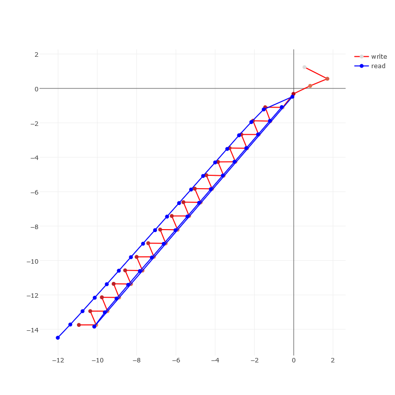

# Lie-Access Neural Turing Machines

This repo hosts the source code for the following paper:

Greg Yang and Alexander M. Rush,
[Lie-Access Neural Turing Machines](https://arxiv.org/abs/1611.02854),
ICLR 2017

It implements several memory systems designed around Lie group actions on a manifold.
LSTM controllers equipped with these "Lie-access memories," together named
Lie Access Neural Turing Machines (LANTMs),
are evaluated on many algorithmic learning tasks.
They are able to learn interesting geometric data structures.
For example, in the following, LANTM is able to learn to store data in a zigzag
fashion in order to solve the oddFirst task.



## Installation

### Torch Dependencies

* `nn`
* `nngraph`
* `penlight`
* `optim`
* `cjson`
* `hdf5`

GPU training requires:

* `cunn`
* `cutorch`

Unit tests require:

 * `totem`

### Python Dependencies

 * `h5py`

## Quickstart

After cloning this repository, you need to regenerate the hdf5 dataset files.
Run the following
```bash
python data/generate.py --makeallhdf5
```

The directory `xopts/` houses the optimal parameters found through grid search,
as described in the paper
[Lie-Access Neural Turing Machines](https://arxiv.org/abs/1611.02854).
To replicate a result, run, for example, the following
```bash
th main.lua --optfile xopts/copy/lantm_copy_smalltrain.json --outfile lantm_copy_smalltrain.result
```

## Datasets

To generate new datasets for the copy task, for example, do the following in a terminal
```bash
python data/generate.py copy data/copy 32 \
	1000 2 64 \
	100 65 128 \
	37
```
This generates a dataset for the copy task at directory `data/copy`,
with batch size 32;
with 1000 training batches of min size 2, max size 64;
with 100 validation batches of min size 65, max size 128;
with alphabet size 37.
The files generated include human-readable text files (.txt)
and an hdf5 file for easy loading into torch/python, along with
translation dicts corresponding strings to numbers.

## Unit Tests

To test dataset generation and loading:
```bash
python data/test_generate.py
```

To test correctness of computation:
```bash
find tests/ -type f -exec th '{}' \;
```

## Checkpoints

A checkpoint is saved in `checkpoint/` after every experiment.
In addition, a checkpoint can be saved in regular intervals by setting
the `checkpoint_freq` option.

To load a checkpoint in an interactive session, set `use_checkpoint=path/to/checkpoint`
in options table, and then call `train.load_or_create()`.